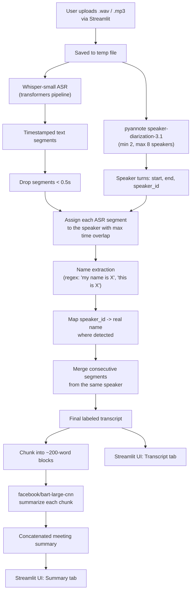

# Processing Pipeline

```mermaid
flowchart TD
    A[User uploads .wav / .mp3\nvia Streamlit] --> B[Saved to temp file]

    B --> C["Whisper-small ASR\n(transformers pipeline)"]
    C --> C1[Timestamped text segments]
    C1 --> C2[Drop segments < 0.5s]

    B --> D["pyannote speaker-diarization-3.1\n(min 2, max 8 speakers)"]
    D --> D1[Speaker turns: start, end, speaker_id]

    C2 --> E[Assign each ASR segment\nto the speaker with max time overlap]
    D1 --> E

    E --> F["Name extraction\n(regex: 'my name is X', 'this is X')"]
    F --> G[Map speaker_id -> real name\nwhere detected]

    G --> H[Merge consecutive segments\nfrom the same speaker]
    H --> I[Final labeled transcript]

    I --> J["Chunk into ~200-word blocks"]
    J --> K["facebook/bart-large-cnn\nsummarize each chunk"]
    K --> L[Concatenated meeting summary]

    I --> M[Streamlit UI: Transcript tab]
    L --> N[Streamlit UI: Summary tab]
```

See [`app/meeting_model.py`](../app/meeting_model.py) (`process_audio`) for the implementation, and [`app/app.py`](../app/app.py) for the Streamlit UI.
